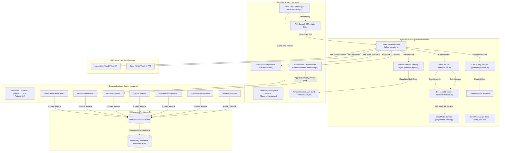

# 🎙️ LokVani AI (LokVani.AI)
> **Inclusive, Voice-First & Trust-Verified Intelligence for Bharat's Farmers & Micro-Vendors**

Built for the **AI for Public Good** track.

---

## 🌟 Overview

Over 500 million non-smartphone users and underserved citizens in India are excluded from current AI advances because existing LLMs rely on complex apps, high text literacy, and top-down static data — while direct AI voice bots risk hallucinating critical financial or agricultural advice.

**LokVani AI** solves this with a **three-tier architecture**:
1. **Voice-First User App (Web Speech STT/TTS):** Speak queries naturally in Hindi or English without typing or complex menus.
2. **Kirana Trust Node Dashboard (Human-in-the-Loop Edge Verifier):** High-stakes queries (e.g. government scheme eligibility, loan paperwork, or chemical pesticide dosage) are automatically flagged and routed to a local Kirana store owner or CSC operator for 1-click verification before final release.
3. **Community Intelligence Network ("Waze for Rural Micro-Economies"):** Crowdsourced real-time Mandi commodity rates and local weather alerts reported by neighboring farmers to give hyper-local insights.

---

## 🏗️ System Architecture

LokVani AI employs a resilient, hybrid, four-tier architecture designed specifically for low-connectivity rural environments, combining real-time multi-lingual voice synthesis, AI-driven risk classification, human-in-the-loop edge verification, and intelligent fallback data pipelines.



### Architectural Pillars

1. **Client Tier (Voice-First & Edge Verification)**
   - **Voice Engine**: Uses native Web Speech API (`SpeechRecognition` & `SpeechSynthesis`) for zero-touch interaction supporting Hindi, English, and hinglish dialectal inputs.
   - **Kirana Trust Node**: Human-in-the-loop review queue for high-stakes queries (e.g. chemical dosage, subsidy forms, loan applications) ensuring 1-click verification before final dispatch.
   - **Community Intelligence Network**: Hyper-local crowdsourced Mandi commodity price submissions and weather updates ("Waze for micro-economies").

2. **AI & Core Intelligence Engine**
   - **Gemini Key Rotator**: Multi-key pool load balancing with instant failover across Google Gemini API keys to handle rate limits and maintain zero downtime.
   - **RAG & Knowledge Grounding**: Queries are cross-referenced with `data_core.csv` and offline scheme knowledge to eliminate hallucinations.
   - **Distress Prediction Engine**: Pure mathematical engine evaluating rainfall deficit/excess, growth stage sensitivity (`stageSensitivity.json`), loan repayment dates, and Mandi price drops to assign continuous risk levels (`NORMAL`, `ADVISORY`, `URGENT`).

3. **Backend API & Middleware Tier**
   - **Express.js API Server**: Hardened with `helmet`, configurable CORS policies, and rate-limiting (`express-rate-limit`).
   - **Email Grievance Dispatcher**: Automated Nodemailer integration for routing scheme grievances directly to official channels.

4. **Storage & Resilience Tier**
   - **Dual-Mode Persistence**: Primary storage on MongoDB Atlas with automatic, zero-crash fallback to an in-memory storage array whenever database connectivity is disrupted.

---

## 🚀 Key Features

* **🎙️ Zero-Barrier Voice Interface:** Dynamic pulsating microphone button with real-time waveform animation using browser-native Web Speech STT/TTS.
* **🛡️ Smart High-Stakes Risk Classifier:** Gemini 1.5 Flash AI automatically tags queries as `AUTO_VERIFIED` or `PENDING_TRUST_REVIEW`.
* **🏪 Kirana Operator Review Hub:** 1-click approve, modify, or add verified voice notes to AI drafts.
* **📈 Real-Time Mandi Commodity Feed:** Crowdsourced prices for Tomatoes, Onions, Potatoes, Wheat, and Rice with location tags and trend indicators.
* **⚡ Instant Pitch Demo Presets:** Pre-loaded audio presets for seamless live venue demonstrations.

---

## 🛠️ Tech Stack & Constraints

* **Frontend:** React 18 + Vite
* **Styling:** Custom Vanilla CSS (Design Tokens, Glassmorphism Dark Mode)
* **Voice Engine:** Web Speech API (`SpeechRecognition` & `SpeechSynthesis`)
* **AI Engine:** Google Gemini 1.5 Flash API (`@google/generative-ai`) + Smart Offline Fallback Engine
* **Icons:** Lucide React Icons

---

## 💻 Local Setup & Development

1. **Clone the repository:**
   ```bash
   git clone https://github.com/SairajTripathy-0077/OOSC-Hackathon.git
   cd OOSC-Hackathon
   ```

2. **Install dependencies:**
   ```bash
   npm install
   ```

3. **(Optional) Add your Gemini API Key:**
   Create a `.env` file in the root directory:
   ```env
   VITE_GEMINI_API_KEY=your_gemini_api_key_here
   ```
   *(Note: If no API key is provided, LokVani AI uses its built-in offline smart reasoning engine).*

4. **Run local dev server:**
   ```bash
   npm run dev
   ```

5. **Build for production:**
   ```bash
   npm run build
   ```

---

## 🌾 Distress Prediction Module

LokVani AI includes a fourth additive pillar: an offline-first **Distress Prediction Module** that quantifies agricultural and financial risk for farmers by analyzing weather deviations, Mandi commodity price drops, crop growth stage sensitivity, and loan repayment schedules.

### Key Architecture:
- **Pure Scoring Engine (`src/engine/distressEngine.js`)**: Implements continuous severity math, crop-stage multipliers (`stageSensitivity.json`), non-linear interaction bonus, loan proximity multiplier, and trend velocity analysis.
- **Explainable Plain-Language Reasons**: Generates zero-jargon spoken reasons (`spokenReasons`) enforced by automated Vitest blocklist checks (`%`, `deviation`, `multiplier`, `score`, `threshold`, `factor`).
- **ICAR-Style Advisory Templates**: Grounded guidance snippets for drought, price crash, and loan repayment situations.
- **Two-Tier Routing**:
  - `ADVISORY`: Displayed in farmer voice app view (`<DistressCard />`).
  - `URGENT`: Automatically routed to Kirana Trust Node review queue (`PENDING_TRUST_REVIEW`) with `DISTRESS_ALERT` tag for human-in-the-loop operator approval.
- **Self-Check Test Suite**: Run engine test suite via `npm run test:engine`.
- **Feature Flag**: Controlled via `VITE_ENABLE_DISTRESS=true` in `.env`.

---

## 📜 License & Track Info

Built with ❤️ for **AI for Public Good**.
